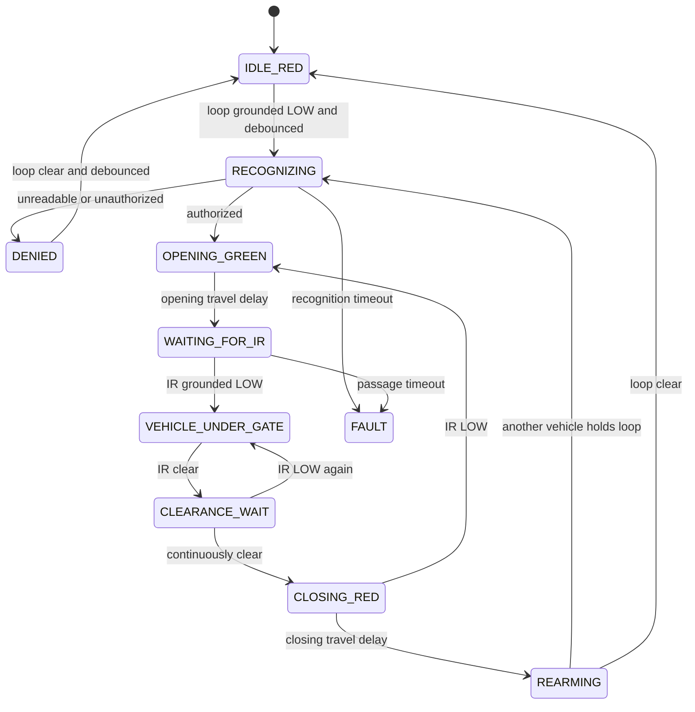

# Implemented Gate-Control Logic

## Electrical contract

The Raspberry Pi uses eleven BCM GPIO lines:

| Signal | GPIO behavior |
| --- | --- |
| Inductive loop | Input with pull-up; grounded LOW means vehicle present |
| IR beam | Input with pull-up; grounded LOW means beam broken |
| Traffic selector | LOW means red; HIGH means green |
| Open command | LOW for one second, otherwise HIGH |
| Close command | LOW for one second, otherwise HIGH |
| RFID capture trigger | Normally HIGH; LOW for 1.5 seconds when loop-triggered capture starts |
| Camera status LED | LOW while unavailable; HIGH after a working camera is recognized |
| Server status LED | LOW while unreachable; HIGH after a successful server response |
| Loop status LED | LOW while clear; HIGH while a vehicle is present |
| Barrier-open status LED | HIGH after OPEN; LOW when CLOSE begins |
| Plate-unrecognized LED | HIGH for unreadable or denied plates |

The open and close outputs are mutually exclusive. OPEN and CLOSE start and
stop HIGH while traffic starts and stops LOW (red), meaning no movement request.
The RFID trigger starts and stops HIGH. All five status LED outputs start and
stop LOW.

## Automatic sequence

1. The controller starts red with both movement outputs HIGH and inactive.
2. The grounded inductive-loop input must remain LOW for the debounce interval.
3. One cycle is locked, the RFID trigger switches LOW asynchronously for 1.5
   seconds, and camera capture starts at the same time.
4. The reader tries one fresh 4K frame, with one
   additional frame captured only when detection or OCR is uncertain.
5. YOLO detects the strongest plate crop in each frame.
6. Each plate row is converted to grayscale and PP-OCRv5 produces a consensus.
7. The plate and crop are sent to the PC website for MySQL authorization.
8. Unreadable, unregistered, expired, inactive, or failed server results remain
   red and produce no movement pulse. The loop must clear before retrying.
9. An authorized result switches the traffic output HIGH and pulses OPEN LOW
   for exactly one second.
10. After the configured opening travel delay, the controller waits for the IR
   input to be grounded LOW, indicating that the vehicle is beneath the barrier.
11. When the IR input returns HIGH, it must remain clear for the configured
    clearance interval.
12. Traffic switches LOW to red and CLOSE pulses LOW for exactly one second.
13. After the configured closing travel delay, the active cycle unlocks.
14. A vehicle already holding the loop input LOW starts one new cycle
    after debounce. Loop activity cannot start a second recognition while the
    current cycle is active.

## Obstruction behavior

If the IR input goes LOW during the closing phase, CLOSE returns HIGH
and the controller immediately enters opening again, switching green and
pulsing OPEN LOW for one second. The software never requests close while IR is
blocked.

If no vehicle passage is detected before the passage timeout, or recognition
does not complete before its timeout, the controller enters `FAULT`: traffic
red, OPEN HIGH, and CLOSE HIGH.

## State machine



## Implementation files

- `src/gate_controller.cpp`: deterministic state machine and safety interlock
- `src/gate_gpio.cpp`: Raspberry Pi libgpiod input/output backend
- `src/rfid_trigger_output.cpp`: asynchronous active-low RFID capture pulse
- `src/main.cpp`: adaptive recognition and server-authorization integration
- `src/gate_simulator.cpp`: macOS and bench simulator
- `tests/gate_controller_tests.cpp`: automated timing and obstruction tests
- `docs/GATE_WIRING_DIAGRAM.md`: GPIO/header wiring diagram

## Activation

GPIO support is built by `build_raspberry_pi.sh`. Automatic gate mode remains
off until the private `.env` contains:

```text
GATE_MODE=1
```

This explicit enable prevents a normal software update from pulsing connected
hardware unexpectedly.
