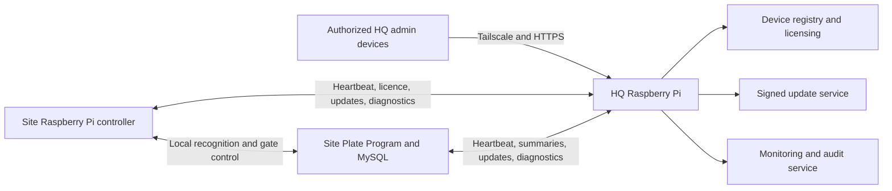

# HQ Server Program Plan

## Objective

HQ is the centralized management system for every Raspberry Pi controller and
every Plate Program installation. It manages enrollment, health, licensing,
camera pairing, security events, remote support, and software releases.

HQ is a management plane, not part of the real-time gate path. Each site must
continue making access decisions locally so gates remain operational when HQ,
Tailscale, or the internet is unavailable.

## Architecture



The responsibilities remain separated:

- The controller performs camera capture, YOLO, OCR, and GPIO gate control.
- The local Plate Program owns registered vehicles and authorizes access.
- The local MySQL database stores customer records, events, and images.
- HQ manages installations, security, versions, and fleet health.
- Plate images and personal records remain at the customer site by default.

## Recommended HQ hardware

For development and the initial rollout:

- Raspberry Pi 5 with 8 GB RAM recommended.
- Raspberry Pi 4 with 4 GB RAM acceptable for a small pilot.
- USB 3 SSD instead of a microSD card for the HQ database.
- Wired Ethernet.
- Proper cooling.
- UPS with automatic safe shutdown.
- Separate encrypted backup destination.

HQ does not run YOLO or OCR, so its normal workload consists of API requests,
database operations, dashboard synchronization, and update distribution.

## Proposed software stack

Create a separate repository named `plate-hq`.

- Python Flask to match the existing Plate Program.
- Gunicorn production server.
- MySQL 8.
- Server-Sent Events for live dashboard updates.
- Tailscale for private connectivity.
- HTTPS and application-level device authentication.
- Native systemd services.
- No Docker.

The installation must provide these commands:

```text
hq -start
hq -stop
hq -restart
hq -status
hq -logs
hq -update
hq -backup
hq -restore
```

A one-time `install_hq.sh` script will install and configure the application,
MySQL, services, backups, and initial administrator.

## Dashboard

### Overview

The primary screen should show the most important fleet information without
scrolling:

- Total sites and installations.
- Controllers online, offline, or degraded.
- Plate Programs online, offline, or degraded.
- Pending activation requests.
- Security alerts.
- Devices requiring updates.
- Recognition-performance summary.
- Last-seen timestamps.
- HQ storage, database, backup, and service health.

### Sites

Each site record contains:

- Customer and installation name.
- Location and timezone.
- Customer contact details.
- Assigned controller and Plate Program.
- Installation date.
- Licence and support status.
- Notes.
- Active, suspended, or retired state.

### Controllers

Each controller page shows:

- Controller ID.
- Raspberry Pi factory serial.
- Tailscale node name, node ID, and address.
- Assigned customer and site.
- Software version and update channel.
- Online status and last heartbeat.
- CPU temperature, memory, storage, and uptime.
- Camera state and paired camera identity.
- Camera-status LED state.
- YOLO and OCR state.
- Recent recognition timings.
- Gate state and GPIO configuration.
- Recent faults and security events.
- Pending update or diagnostic command.

HQ must not provide a remote **Open barrier** action. Barrier movement remains
under the local safety state machine.

### Plate Programs

Each program page shows:

- Program ID and assigned site.
- Tailscale identity.
- Software version.
- MySQL and website health.
- Database and image-storage usage.
- Registered-vehicle count.
- Authorized and denied activity summaries.
- Last controller communication.
- Last successful backup.
- Recent errors and update status.

HQ receives operational summaries, not the complete customer vehicle database
unless centralized backup is explicitly added later.

### Activations

Only an authorized HQ administrator can approve a new installation.

A pending activation displays:

- Raspberry Pi serial.
- Tailscale node identity.
- Camera identity.
- Requested customer and site.
- Installed software version.
- Request time.
- Duplicate or suspicious identity warnings.

Approval creates a signed installation licence bound to:

- Controller ID.
- Raspberry Pi serial.
- Camera identity.
- Customer site.
- Tailscale node identity.
- Licence dates and grace period.
- Permitted software update channel.

### Updates

The dashboard supports:

- Controller and Plate Program releases.
- Release-signature verification.
- Pilot, stable, and delayed update channels.
- Individual and grouped deployments.
- Staged rollouts.
- Success and failure reporting.
- Automatic rollback.
- Fleet version compliance.

Production devices should eventually download signed packages from HQ instead
of using `git pull`.

### Security and audit

The audit log records:

- Administrator authentication.
- Controller and Program enrollment.
- Activation approval or rejection.
- Camera pairing changes.
- Licence renewal, suspension, and revocation.
- Update deployment and rollback.
- Remote restart or diagnostic request.
- Configuration changes.
- Failed authentication.
- Raspberry Pi serial mismatch.
- Duplicate controller identity.
- Unexpected camera identity.
- Tailscale identity changes.

Audit records must be append-only from the dashboard.

## Database design

| Table | Purpose |
| --- | --- |
| `sites` | Customer and installation records |
| `controllers` | Raspberry Pi identity, version, assignment, and status |
| `program_instances` | Plate Program installations |
| `cameras` | Approved and paired cameras |
| `device_licenses` | Signed controller licences and grace periods |
| `activation_requests` | Pending provisioning requests |
| `heartbeats` | Current and historical device health |
| `site_metrics` | Aggregated activity and performance summaries |
| `software_releases` | Signed Controller and Program releases |
| `deployments` | Update rollout history |
| `remote_commands` | Restart, update, and diagnostic requests |
| `security_events` | Authentication, cloning, and identity alerts |
| `hq_users` | HQ administrators and support users |
| `audit_log` | Administrative activity |
| `settings` | HQ-wide configuration |

Required uniqueness rules:

- One active controller per Raspberry Pi serial.
- One active Tailscale identity per controller.
- One active camera pairing per controller.
- One camera cannot belong to two active controllers.
- One Plate Program identity belongs to one site unless explicitly configured.

## Device APIs

### Controller

```text
POST /api/v1/controllers/enroll
POST /api/v1/controllers/heartbeat
POST /api/v1/controllers/renew-license
GET  /api/v1/controllers/update
POST /api/v1/controllers/commands/next
POST /api/v1/controllers/commands/result
```

### Plate Program

```text
POST /api/v1/programs/enroll
POST /api/v1/programs/heartbeat
POST /api/v1/programs/summary
GET  /api/v1/programs/update
POST /api/v1/programs/commands/result
```

Suggested intervals:

- Controller heartbeat every 30 to 60 seconds.
- Plate Program heartbeat every 60 seconds.
- Offline warning after approximately three missed heartbeats.
- Historical heartbeat data downsampled to prevent unlimited database growth.

## Security model

Tailscale provides private transport but does not replace application-level
device authentication.

Initial controls:

- A permanent HQ tailnet.
- Single-use Tailscale enrollment keys.
- `tag:unprovisioned` before approval.
- `tag:controller` after controller approval.
- `tag:site-server` for Plate Program computers.
- Key expiry disabled for deployed tagged devices.
- Signed installation licences.
- Unique application credentials for every controller and Program.
- HTTPS, timestamps, nonces, and replay protection.
- Manual HQ approval before gate functions can be activated.

Tailscale Grants should permit:

- Unprovisioned devices to reach only the activation API.
- Controllers to reach HQ and their assigned Plate Program only.
- Plate Programs to reach HQ and their assigned controller only.
- Admin devices to reach HQ and explicitly approved SSH services.
- No controller-to-controller communication.

Tagged devices are intended for non-human infrastructure, and key expiry is
disabled by default when a tag is first applied. See the
[Tailscale tag documentation](https://tailscale.com/docs/features/tags).

Future hardening:

- Secure element or TPM.
- Tailnet Lock.
- Raspberry Pi secure boot.
- Encrypted controller and model package.
- Mutual TLS.
- Hardware-authenticated camera module.
- Offline or hardware-protected software signing keys.

## Offline behavior

HQ must not be contacted for every vehicle.

The controller receives a signed operating lease and renews it periodically.
If HQ, Tailscale, or the internet is unavailable:

- Existing gates continue operating locally during the configured grace period.
- Local vehicle authorization continues.
- Barrier safety sensors and interlocks continue.
- HQ marks the installation offline.
- New activations and updates remain blocked.
- Site and HQ administrators receive warnings before the grace period expires.

Manual operation and emergency egress must never depend on HQ licensing.

## Implementation phases

### Phase 1: HQ foundation

- Create the `plate-hq` repository.
- Add the MySQL schema and migrations.
- Add administrator login, roles, and audit logging.
- Build Sites, Controllers, Programs, and Overview pages.
- Limit access to Tailscale and HTTPS.
- Create installation, management, backup, and restore commands.

### Phase 2: Monitoring

- Add the controller heartbeat client.
- Add the Plate Program heartbeat client.
- Report health, versions, storage, and recognition timing.
- Display live online, offline, and degraded states.
- Add alerts and health history.

### Phase 3: Controlled enrollment

- Add the pending activation workflow.
- Register Raspberry Pi serials.
- Issue and verify signed licences.
- Add camera enrollment and pairing.
- Reject duplicate and mismatched identities.
- Use separate one-time Tailscale and HQ activation credentials.

### Phase 4: Remote support

- Add service restart commands.
- Add diagnostic collection and log retrieval.
- Add safe configuration inspection.
- Enforce administrator roles and audit every operation.
- Do not add remote barrier movement.

### Phase 5: Signed updates

- Replace production `git pull` updates.
- Build signed Controller and Program packages.
- Add staged rollout, version checks, and rollback.
- Record every deployment result.

### Phase 6: Production hardening

- Enable Tailnet Lock.
- Add secure-element support.
- Add secure boot and verified storage.
- Encrypt the model and controller application.
- Move signing keys off the HQ Raspberry Pi.
- Document disaster recovery and perform restoration drills.

## Acceptance tests

Before an installation is shipped:

- It reconnects after power and internet outages.
- HQ identifies it by controller ID, Pi serial, and Tailscale identity.
- A cloned SD card in another Pi generates an identity-mismatch alert.
- An unapproved camera is rejected after camera pairing is enabled.
- HQ failure does not interrupt local gate operation.
- Updates can automatically roll back.
- Revoking a controller removes its HQ management access.
- HQ database restoration preserves all site and device assignments.
- A controller cannot reach another customer's controller or Plate Program.
- All sensitive administrative operations appear in the audit log.

## First milestone

The first deployable milestone is an HQ dashboard showing every controller and
Plate Program with:

- Online state.
- Last heartbeat.
- Hardware identity.
- Site assignment.
- Software version.
- Camera and service status.
- Storage and temperature.
- Recognition timing.
- Recent errors.

Controlled enrollment, signed licensing, camera pairing, and signed updates are
added after this monitoring path is stable.
